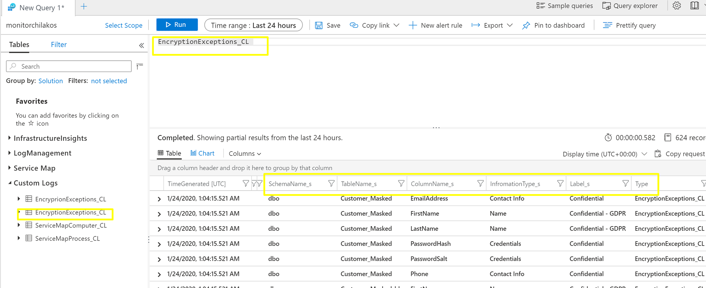

## Detect and Audit SQL DB non encrypted PII data

SQL Auditor is application that queries Azure SQL server which has Threat Protection enabled,to find any columns with PII (Marked as Confidential, Confidential-GDPR etc) but not encrypted using Always Encrypted.

These exceptions are then reported to Log Analytics for further reporting.

## Run locally

To run locally , set `appsettings.json` configuration
```
{
  "ConnectionStrings": {
    "DBToAudit": "Server=tcp:<SERVER>.database.windows.net,1433;Database=dataflow;User ID=<USER>;Password=<PASSWORD>;Encrypt=true;Connection Timeout=30;"
  },

  "LAWorkspaceId": "<Log Analytics Workspace ID>",
  "LAKey":  "<Log Analytics Primary or secondary key>"
}
```

And run
```
> dotnet run 

SqlAuditor Loaded.
Connecting to  Database dataflow:
=========================================
info: sqlaudit_runner.SqlAuditor[0]
      Found Not Encrypted sensitive data Columns 26
info: sqlaudit_runner.SqlAuditor[0]
      Sending found records to LogAnalytics Id: xxxxx-xxxxx
info: sqlaudit_runner.SqlAuditor[0]
      Sent found records to LogAnalytics HTTP Status: OK
```

## Run as Kubernetes CronJob
To run this job periodically use Kubernetes CronJob  `k8sjob.yaml` definition

- First create ConfigMap with settings to mapped to container, e.g

```sh
kubectl create configmap sqlauditor-settings --from-file appsettings.Development.json
```

- Create Job
```sh
kubectl apply -f k8sjob.yaml
```

Job definition

```yaml
apiVersion: batch/v1beta1
kind: CronJob
metadata:
  name: sqlauditor
spec:
  schedule: "* */1 * * *"
  jobTemplate:
    spec:
      completions: 1  #at least one success
      backoffLimit: 3 #retries
      template:
        spec:
          containers:
          - name: sqlauditor
            image: lenisha/sqlauditor
            volumeMounts:
            - name: config
              mountPath: /app/appsettings.json
              subPath: appsettings.Development.json
          restartPolicy: OnFailure
          securityContext:
            runAsUser: 1000
            runAsGroup: 3000
          ## kubectl create configmap sqlauditor-settings --from-file appsettings.Development.json
          volumes:
          - name: config 
            configMap:
              name: sqlauditor-settings   
```

when running, see job defined and completed runs
```
 kubectl get cronjobs
NAME         SCHEDULE      SUSPEND   ACTIVE   LAST SCHEDULE   AGE
sqlauditor   * */1 * * *   False     0        26s             6m31s

k get pods
NAME                            READY   STATUS              RESTARTS   AGE
sqlauditor-1579827960-g284n     0/1     Completed           0          62s
sqlauditor-1579828020-wkhhv     0/1     ContainerCreating   0          2s
```

## Log Analytics

View custom Logs in the Workspace, LogType = `EncryptionExceptions_CL`



## Sentinel